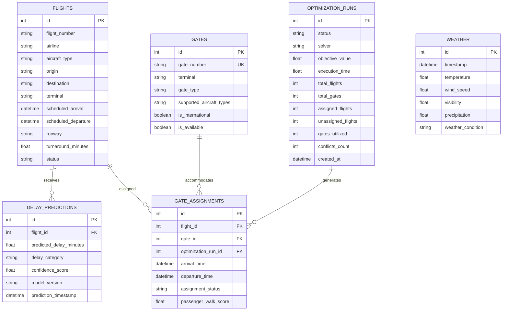

# Database Design & Schema Architecture

## Overview
AeroOptima utilizes SQLAlchemy 2.0 ORM with native support for SQLite in development and PostgreSQL in enterprise deployments.

```mermaid
erDiagram
    FLIGHTS ||--o{ DELAY_PREDICTIONS : receives
    FLIGHTS ||--o{ GATE_ASSIGNMENTS : assigned
    GATES ||--o{ GATE_ASSIGNMENTS : accommodates
    OPTIMIZATION_RUNS ||--o{ GATE_ASSIGNMENTS : generates

    FLIGHTS {
        int id PK
        string flight_number
        string airline
        string aircraft_type
        string origin
        string destination
        string terminal
        datetime scheduled_arrival
        datetime scheduled_departure
        string runway
        float turnaround_minutes
        string status
    }

    GATES {
        int id PK
        string gate_number UK
        string terminal
        string gate_type
        string supported_aircraft_types
        boolean is_international
        boolean is_available
    }

    DELAY_PREDICTIONS {
        int id PK
        int flight_id FK
        float predicted_delay_minutes
        string delay_category
        float confidence_score
        string model_version
        datetime prediction_timestamp
    }

    GATE_ASSIGNMENTS {
        int id PK
        int flight_id FK
        int gate_id FK
        int optimization_run_id FK
        datetime arrival_time
        datetime departure_time
        string assignment_status
        float passenger_walk_score
    }

    OPTIMIZATION_RUNS {
        int id PK
        string status
        string solver
        float objective_value
        float execution_time
        int total_flights
        int total_gates
        int assigned_flights
        int unassigned_flights
        int gates_utilized
        int conflicts_count
        datetime created_at
    }

    WEATHER {
        int id PK
        datetime timestamp
        float temperature
        float wind_speed
        float visibility
        float precipitation
        string weather_condition
    }
```
