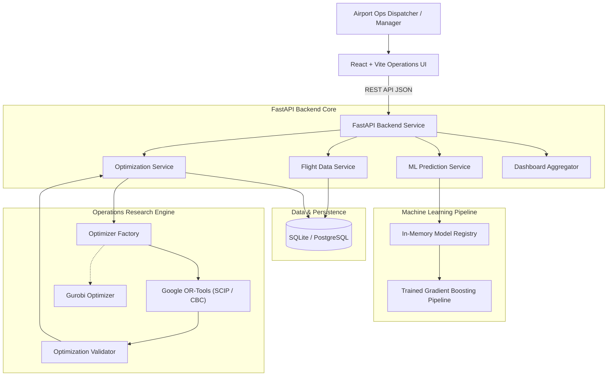

# System Architecture Documentation

## 1. Problem Statement
Airports face severe operational bottlenecks when unexpected runway and taxi delays disrupt pre-planned gate assignments. Traditional scheduling methods either ignore delay dynamics or rely on static buffers that result in severe gate conflicts, lengthy passenger walking times, and cascaded propagation of downstream delays.

## 2. Objective
**AeroOptima** provides a dual-engine decision-support system that:
1. Employs **Machine Learning Regressors (Gradient Boosting / Random Forest)** to forecast incoming runway & taxi queue delays before gate arrival.
2. Ingests real-time predicted delay metrics into a **Mixed Integer Linear Programming (MILP)** optimization engine (**Google OR-Tools / Gurobi**) to compute optimal, conflict-free airport gate assignments while minimizing passenger walking distance and turnaround delay propagation.

## 3. High-Level Architecture Diagram

## 4. End-to-End Data Flow
1. **Historical / Current Flight Ingestion:** Ingested via REST API or CSV upload.
2. **Feature Engineering:** Computes non-leaking time features, congestion densities, duration windows, and meteorological covariates.
3. **ML Delay Prediction:** Estimates taxi/runway delay in minutes and assigns operational delay category (*On Time, Low, Moderate, High, Severe*).
4. **Time Window & Compatibility Synthesis:** Formulates effective occupancy intervals $[t_{arr} + \Delta_{delay}, t_{dep} + turnaround]$.
5. **MILP Formulation & Solving:** Solves the binary assignment matrix $x_{f,g} \in \{0, 1\}$.
6. **Constraint Validation:** Asserts zero interval overlap on every gate, terminal compatibility, and aircraft type limits.
7. **Interactive Dashboard & Timeline Display:** Renders KPIs, Gantt charts, airline comparisons, and CSV export.
