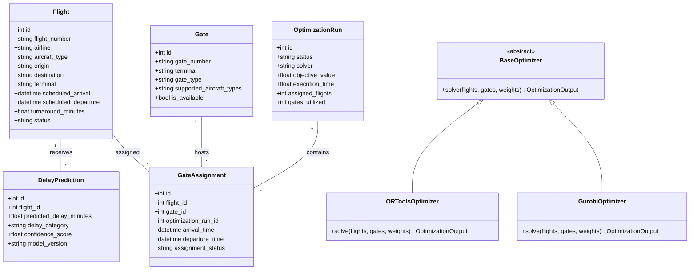

# UML Class Diagram

```mermaid
classDiagram
    class Flight {
        +int id
        +string flight_number
        +string airline
        +string aircraft_type
        +string origin
        +string destination
        +string terminal
        +datetime scheduled_arrival
        +datetime scheduled_departure
        +float turnaround_minutes
        +string status
    }

    class Gate {
        +int id
        +string gate_number
        +string terminal
        +string gate_type
        +string supported_aircraft_types
        +bool is_available
    }

    class DelayPrediction {
        +int id
        +int flight_id
        +float predicted_delay_minutes
        +string delay_category
        +float confidence_score
        +string model_version
    }

    class GateAssignment {
        +int id
        +int flight_id
        +int gate_id
        +int optimization_run_id
        +datetime arrival_time
        +datetime departure_time
        +string assignment_status
    }

    class OptimizationRun {
        +int id
        +string status
        +string solver
        +float objective_value
        +float execution_time
        +int assigned_flights
        +int gates_utilized
    }

    class BaseOptimizer {
        <<abstract>>
        +solve(flights, gates, weights) OptimizationOutput
    }

    class ORToolsOptimizer {
        +solve(flights, gates, weights) OptimizationOutput
    }

    class GurobiOptimizer {
        +solve(flights, gates, weights) OptimizationOutput
    }

    BaseOptimizer <|-- ORToolsOptimizer
    BaseOptimizer <|-- GurobiOptimizer
    Flight "1" -- "*" DelayPrediction : receives
    Flight "1" -- "*" GateAssignment : assigned
    Gate "1" -- "*" GateAssignment : hosts
    OptimizationRun "1" -- "*" GateAssignment : contains
```
