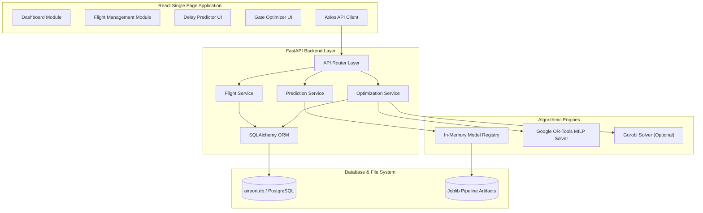
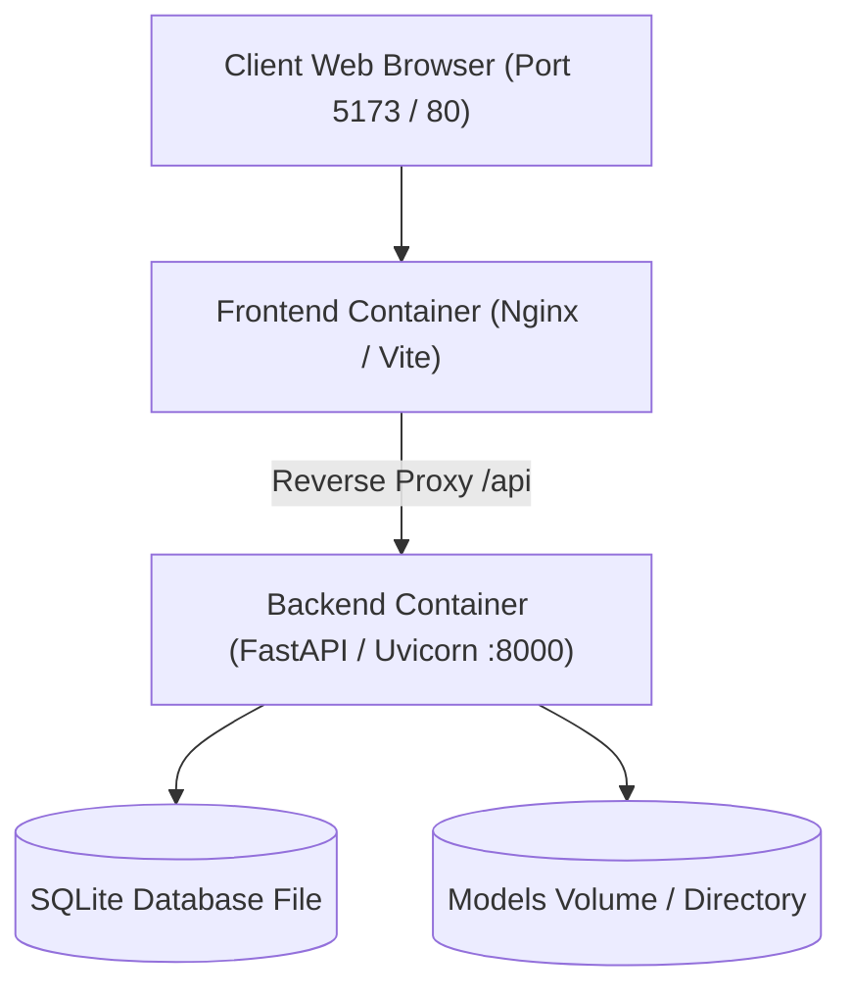

# UML Component & Deployment Diagrams

## Component Diagram

```mermaid
graph TD
    subgraph Frontend_Client["React Single Page Application"]
        DashboardComp["Dashboard Module"]
        FlightComp["Flight Management Module"]
        PredComp["Delay Predictor UI"]
        OptComp["Gate Optimizer UI"]
        AxiosClient["Axios API Client"]
    end

    subgraph Backend_Server["FastAPI Backend Layer"]
        Router["API Router Layer"]
        FlightSvc["Flight Service"]
        PredSvc["Prediction Service"]
        OptSvc["Optimization Service"]
        DBEngine["SQLAlchemy ORM"]
    end

    subgraph Solvers_And_Engines["Algorithmic Engines"]
        ModelReg["In-Memory Model Registry"]
        ORToolsEngine["Google OR-Tools MILP Solver"]
        GurobiEngine["Gurobi Solver (Optional)"]
    end

    subgraph Storage["Database & File System"]
        SQLiteDB[("airport.db / PostgreSQL")]
        ModelFiles[("Joblib Pipeline Artifacts")]
    end

    AxiosClient --> Router
    Router --> FlightSvc
    Router --> PredSvc
    Router --> OptSvc

    FlightSvc --> DBEngine
    PredSvc --> ModelReg
    OptSvc --> ORToolsEngine
    OptSvc --> GurobiEngine
    OptSvc --> DBEngine

    DBEngine --> SQLiteDB
    ModelReg --> ModelFiles
```

## Deployment Diagram

```mermaid
graph TD
    ClientBrowser["Client Web Browser (Port 5173 / 80)"] --> NginxContainer["Frontend Container (Nginx / Vite)"]
    NginxContainer -->|Reverse Proxy /api| FastAPIContainer["Backend Container (FastAPI / Uvicorn :8000)"]
    FastAPIContainer --> LocalDB[("SQLite Database File")]
    FastAPIContainer --> ModelsVol[("Models Volume / Directory")]
```
