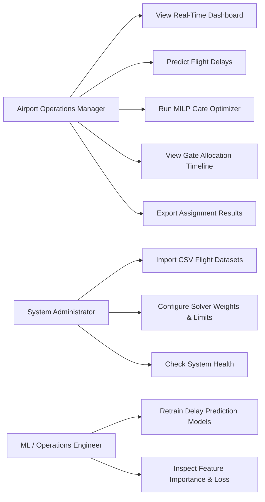

# UML Use Case Diagram

```mermaid
graph LR
    OpsManager["Airport Operations Manager"]
    SysAdmin["System Administrator"]
    MLEngineer["ML / Operations Engineer"]

    OpsManager --> UC1["View Real-Time Dashboard"]
    OpsManager --> UC2["Predict Flight Delays"]
    OpsManager --> UC3["Run MILP Gate Optimizer"]
    OpsManager --> UC4["View Gate Allocation Timeline"]
    OpsManager --> UC5["Export Assignment Results"]

    SysAdmin --> UC6["Import CSV Flight Datasets"]
    SysAdmin --> UC7["Configure Solver Weights & Limits"]
    SysAdmin --> UC8["Check System Health"]

    MLEngineer --> UC9["Retrain Delay Prediction Models"]
    MLEngineer --> UC10["Inspect Feature Importance & Loss"]
```
